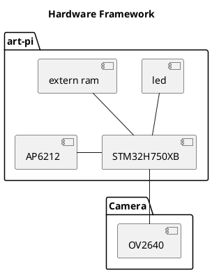

#【嵌入式芯片与系统设计竞赛】基于AI和网络的入侵检测摄像头

**作者：田昶，潘宇航，黄柏翰**
## 1.1简介

随着科技的进步，越来越多的方面开始运用AI来代替人工判决，基于物联网的智能家居产业也愈发繁荣。本入侵检测摄像头基于STM32+RTThread平台，实时采集数据、利用人检测模型判决当前情况，并根据判决结果上传图片数据至云端服务器。

## 1.2 主要功能
**人检测**：根据内置的人检测模型，实时判断当前区域是否有人进入
**蜂鸣报警**：有人入侵即时发出警报
**上传入侵图图片**：检测到有人入侵后立即将该证据上传至服务器留存

## 1.3 开发环境
硬件：ART-PI（STM32H750主控）+ OV2640模组
RT-Thread版本：4.0.3
开发工具及版本：RT-Thread Studio 1.1.5

## 1.4 RT-THread使用情况
> 内核部分：调度器，信号量，内存管理
> > 调度器：多任务调度
> > 信号量：用于唤醒对应任务
> > 内存管理：动态内存申请与释放

> 组件部分：虚拟文件系统，I2C，RT-AK，lwIP，SAL
> > I2C：配置摄像头模块需要
> > RT-AK: 用于生成AI模型C语言代码
> > lwIP: 网络数据包管理
> > SAL: 网络域名的解析

> 软件包部分: webClient, ov2640
> > webClient：向服务器上传图片数据
> > ov2640: 实时采集图像


## 1.5 软件说明
camera_on（） 这个程序主体部分启动了摄像头DCMI的数据流传输
ifperson_app（dest）  AI模型的应用层，向其中传输位图数据，得到判断出来的概率值
Bilinear_interpolation_algorithm（array_in_320X240,array_out_50X50） 双线性插值算法的C语言实现，将320X240的图像数据压缩成50X50的压缩数据，传入到轻量级的AI模型中
## 1.6 硬件框架

总体的硬件框架如下图所示：


## 1.7 软件框架说明
红外接收判断
	->摄像头数据传输
		->摄像头数据处理
			->Ai模型判断
				->网络层传输
### 1.7.1 系统框架
main线程->摄像头及ai判断
tcp线程->建立网络连接
### 1.7.2 通信接口及流程
位图数据存入到初始化开辟的固定空间中，在各个处理函数中以二维数组的形式被调用，接入到ai模型时需要双线性插值压缩以满足在opencv中的压缩图片效果，接入到网络传输层时需要添加消息头、文件头等以满足网络传输文件的条件
#### 1.7.2.1 Onenet
 - POST 发布的产品、设备、数据流与应用

`/入侵检测摄像头/RT-Thread/person_dectation`, 用于接收图片的二进制数据并显示为图片。
`/person`, 作为独立应用，展示上文数据流的图片，且可扩展为不同产品、设备下的数据流的可视化展示。

 - POST上传二进制文件的API接口
`http://api.heclouds.com/bindata?device_id=787994914&datastream_id=person_dectation`, 其中包含两个参数，分别为设备ID与数据流名称。

 - HTTP报文的消息头
 ```
 #define _content_type   "Content-Type: image/jpg\r\n"
 #define _api_key        "api-key: <Your API-Key>\r\n"
 //分别是上传数据类型与连接鉴权信息，该API-Key只可用于该设备下的所有数据流，另一种鉴权方式是使用token鉴权，可获得该产品下所有设备数据收发权限。
 ```
 - 其他
 上传BMP格式的图片，采用字符数组的方式，并在webClient包的基础上作了改动，以更适用于上传任务，与onenet软件包使用mqtt相比，通过对webClient软件包的直接调用，免去了冗余信息，且不需要心跳包保持在线状态。

#### 1.7.2.2 Bemfa云
 - POST 发布的topic
`/pic`, 通过官方API接口上传数据，服务器直接显示图片。

 - HTTP消息头
 ```
 #define _content_type                 "Content-Type: image/jpg\r\n"
 #define _authorization                "Authorization: <Your key>\r\n"
 #define _topic                        "Authtopic: pic\r\n"
 //分别为上传图片数据类型、用户私钥与上传的topic
 ```
#### 1.7.2.3 注意事项
上述消息头都已略去必要的长度、协议版本、agent等信息


